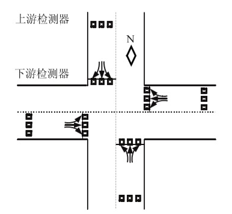
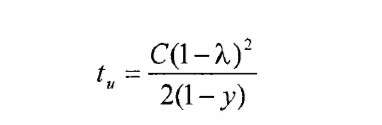
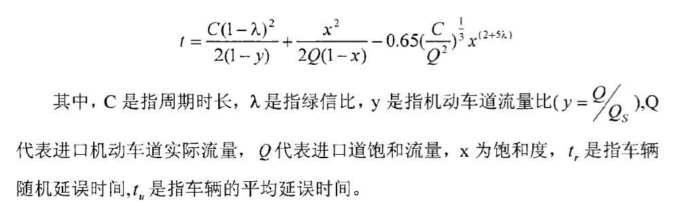
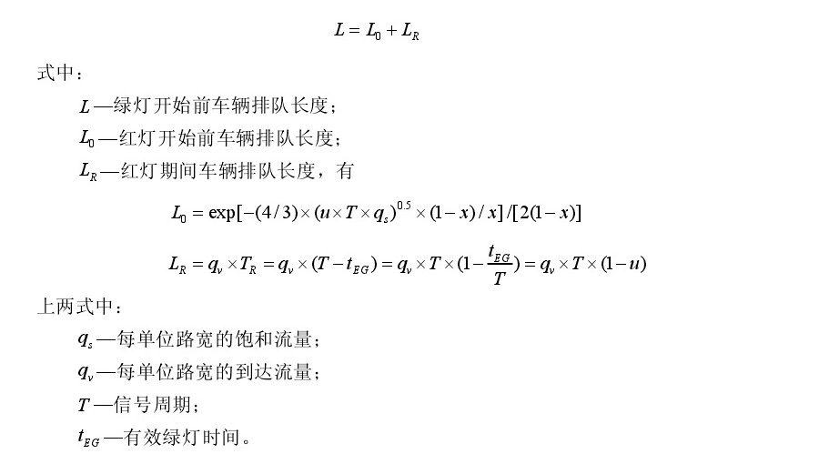
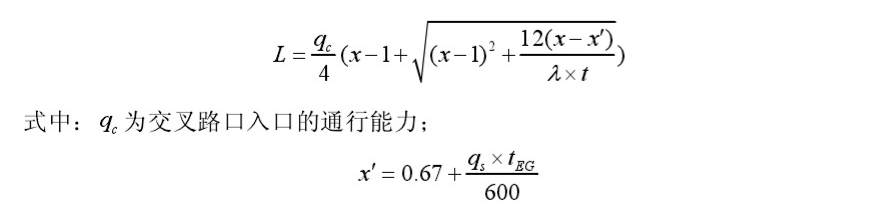
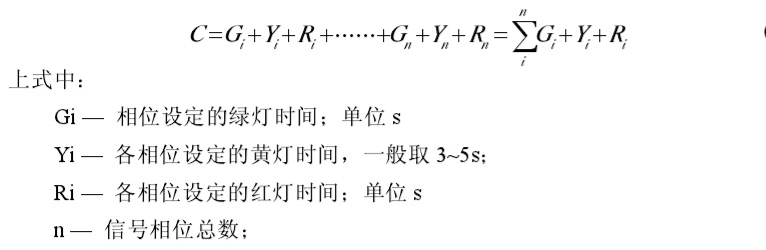
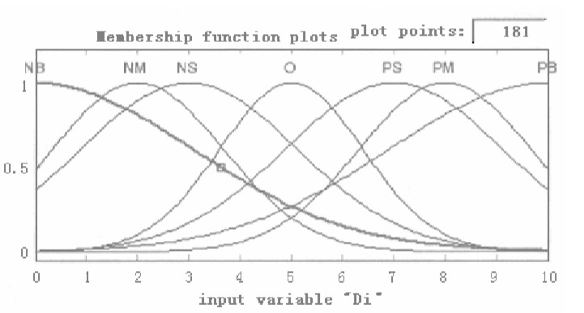
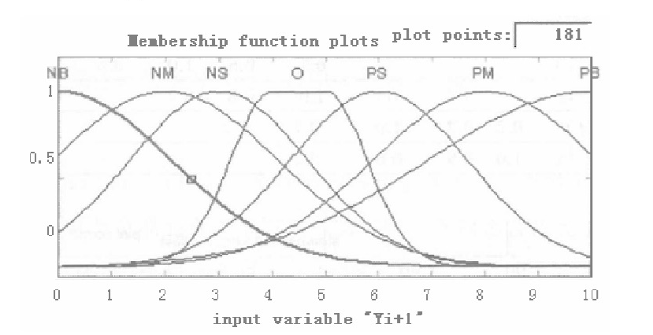
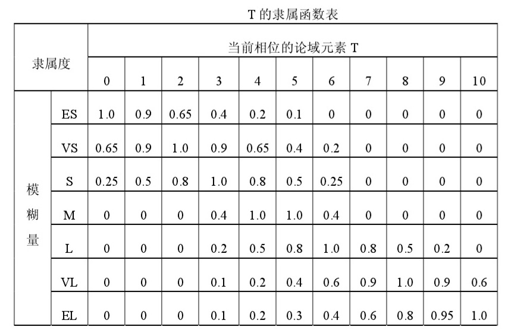
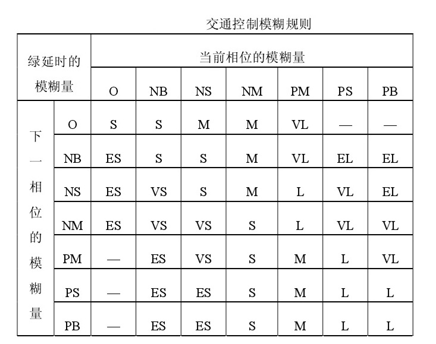

##封面页

---

论文进展情况：

## 一、交通信号控制基本理论

### 1.1 交通信号及通行行为控制

### 1.2 交通流基本理论
#### 1.2.1 交通流的基本参数及关系
#### 1.2.2 简单城市道路交通流模型
#### 1.2.3 交通流的分布规律

### 1.3 交通信号控制参数和方式

## 二、交通信号相位控制

### 2.1 四相位交叉口几何模型描述

### 2.2 交叉口车辆平均延误计算模型

## 三、交通信号控制的性能评价指标

## 四、交通信号模糊控制

### 4.1 模糊控制基本原理

### 4.2 模糊控制器的设计

### 4.3 交通信号模糊控制思路

### 4.4 交通信号模糊控制器设计
#### 4.4.1 模糊控制输入量与输出量的确定
#### 4.4.2 输入、输出变量的模糊化
#### 4.4.3 模糊规则的设计
#### 4.4.4 信号灯模糊控制算法的具体描述

---

## 一、交通信号控制基本理论

交通信号是在空间上无法实现车辆分离的地方，在时间上对交通流分配通行权的一种交通指挥措施。灯光信号通过交通信号灯的红色来指挥交通。目前世界各国信号灯的含义基本上进行了统一规定。我国规定如下：  
红灯：表示禁止该灯面对方向的车辆和行人通行；  
绿灯：表示允许该灯所面对方向的车辆和行人通行，而转弯的车辆在不妨碍直行车辆以及已经进入人行通道的行人可以继续通行；  
黄灯：表示不允许该灯所对方向的车辆和行人同通行。但是，已经越过停止线的车辆以及已经进入人行通道的行人可以继续通行；  
绿色箭头：表示该灯对应方向的车辆可以按照箭头所指方向通行；  
在道路右边没有人行横道和直行车辆的情况下，右转车辆在遇到黄灯或红灯时，可以在不妨碍放行车辆和行人通行的条件下通行。

### 1.1 交通信号及通行行为控制

交叉路口通行行为控制是道路的交通控制的重点。使用交通信号灯对交叉路口处人和车辆的通行行为控制是道路交通系统中最具代表性的控制方法。这种控制方法借助自动化设备来控制交通信号灯等色的变换，针对人发出通行停止的行为控制命令，实现对交叉路口人和车辆通行行为的实时控制。

交叉路口机动车按交通规则直行、右转、左转自由通行交叉路口，不同车辆通行行驶轨迹在交叉口区域形成了多个冲突点，这些冲突点分为交叉点和合流点。如图

由图可知，交叉路口的冲突点数随着车流量的增加而增加。十字路口交叉口机动车辆通行将形成24个冲突点。当行人交通量增加时，路口自由通行行为发生交通行为主体之间的通行冲突的可能性将急剧增加。交通控制信号控制不同道路方向的交通流的通行行为，消除或减少通行冲突，保证通行安全。

### 1.2 交通流基本理论

交通流理论是分析研究道路上行人和机动车辆（主要是汽车）在个别或成列行动中的规律，探讨车流流量、流速和密度之间的关系，以求减少交通时间的延误、事故的发生和提高道路交通设施使用效率的理论。始于50年代。是交通工程理论的基础和其新发展的领域之一。

#### 1.2.1 交通流的基本参数及关系
交通流是指各个进道口的车辆，主要参数有交通量q，车流密度k，行驶速度v。

交通量q是指在一段时间内通过某进道口断面的车辆数，单位是"辆/车道"。车流密度k是指一段时间内某车道的平均车辆数，单位是"辆/千米/车道"。行驶速度v指的是一段时间内某车道车辆行驶速度的平均值，单位是"km/h"。他们的关系是

q=k·v

#### 1.2.2 简单城市道路交通流模型

城市道路的特点是存在大量的平面交叉口，不同方向车流的冲突也在发生。在研究城市道路交通重点应该集中在交叉路口的交通特性上。如图为单交叉路口的道路交通流模型：

.png)

#### 1.2.3 交通流的分布规律

交通流在一定的观测周期内到达的车辆数服从泊松分布、二项分布、负二项分布等离散型分布规律。  
1）泊松分布  
车辆（或人）的到达时随机的，相互之间影响不大，也不受外界干扰，这种情况发生在交通流密度不大的时候。  
2）二项分布  
车辆比较拥挤、自由行使机会不多的车流。  
3）负二项分布  
到达量波动很大的车流。

### 1.3 交通信号控制参数和方式

#### 1.3.1交通信号控制的基本参数

交通信号控制的基本参数包括相位、周期、绿信比等。交通控制系统的控制目标就是通过确定控制参数来达到调控道路流量的目的。  
1）相位  
为了避免交叉路口各个方向交通流之间的冲突，通常可以在时间和空间上划分车流。在空间上采用高架桥，在时间上采用分时通行。在某一段时间内，交叉口的某一支或多支交通流具有通行权，与之冲突的交通流不能通行。这一时间段称为信号相位，简称相位。相位时间包括绿灯时间和黄灯时间。  
2）周期  
周期是各个信号灯全部显示一遍的时间和。周期是决定控制定时信号交通效益的关键控制参数。周期时间不能太短，否则不能保证各个方向的车流通行。周期时间也不能够太长，会导致司机错误的判断，导致不可预料的危险。理想情况是每个相位绿灯时间恰好该入口等待车辆全部放行完毕。  
3）绿信比  
绿信比是一个信号相位的有效绿灯时长与该相位所属周期时长的比值。设某相位有效绿灯时长为Tgi，该相位所属周期时长为C，则绿信比λ为：

λ=Tgi/C

显然0<λ<1，绿信比对疏通交通流十分重要。合理的绿信比可以使各个方向车流停车次数和等待延误时间减至最小。

#### 1.3.2交通信号的控制方式

交通信号控制有各种各样的方式，其分类也有很多种。  
按控制范围分类，可以将信号控制分为点控、线控和面控。  
按控制方法分类，可以分为定时控制、感应控制等。

1）单交叉口信号控制（点控制）
每个交叉口的交通控制信号只按照该交叉口的交通情况独立运行，不与其邻近交叉口的控制信号有任何联系的，称为单个交叉口交通控制，即"点控制。这是交 叉口交通信号控制的最基本形式。

2）干道交通信号协调控制（线控制）  
把干道上若干个连续交叉口的交通信号通过一定的方式联结起来，同时对各交 叉口设计一种相互协调的配时方案，各交叉口的信号灯按此协调方案联合运行，使车辆通过这些交叉口时，不致经常遇上红灯，称为干道信号协调控制。也叫"绿波"信号控制，俗称"线控制"。

3）区域交通信号协调控制（面控制）  
以某个区域中所有信号控制交叉口作为协调控制的对象，简称为区域交通信号控制系统，俗称"面控制"。

4）定时控制  
交叉口信号控制机均按事先设定的配时方案运行，也称为定周期控制。

5）感应控制  
①半感应控制；  
半感应控制首先进行次路检测，而后进行主路检测。  
②全感应控制  
全感应式控制的特点是在所有入口车道上都设置检测器的感应控制方式。适用于相交道路等级相当，交通量相仿且变化较大的交叉口上。

本文主要研究基于定时控制与模糊控制相结合的单点交通信号的控制。

## 二、交通信号相位控制

在一个信号变化周期内，把每一种可能通过的控制（即对各进口通道不同方向所显示的不同信号灯颜色的组合）成为一个信号相位。一般信号灯控制多采用两个相位，即二项制，东西通行南北禁止为第一相位，东西禁止南北通行为第二相位。二相位可以消除一些通行冲突点，但没有消除"左-直"的通行冲突。这时可以设置专用信号灯相位，这就采用了三相信号灯控制，相位越多，通行权分配越细，冲突点就越少。

### 2.1 四相位交叉口几何模型描述

如图，这是一个典型的四相位交叉口交通流模型，该交叉口有四个进口道，每个进口道有三支车流（左转，直行和右转），除了比较特殊的情况，右转车辆可以不受信号灯的约束通过交叉路口。实施多相位控制可以消除直行车辆和左转车辆的冲突，提高行车的安全性。

为了实现交通的实时控制，需要在每个车道上安装两个感应线圈检测器来获得实时的交通流信息。第一个检测器放在停车线的位置，第二个检测器安装在距离第一个检测器180米的位置，交叉口车辆检测器的安装如下图1设置。设置小汽车的平均长度为4.5米，行车的安全距离5.5米，停车时的间距为1.5米，则检测器可以检测的车辆可达30PCU，能够满足实际交叉口排队长度的要求。为了方便对比，一般交通信号感应控制检测器安装如下图2所示。

### 2.2 交叉口车辆平均延误计算模型

交通信号的控制是为了减小车辆通过交叉口的延误，车辆的平均延误也在一定程度上反映了交叉口的通行能力，这里以车辆的平均延误作为交叉口信号控制的性能评价指标，平均延误小代表控制性能好。  
到达交叉口各个方向车辆是随机的，非拥挤交通流的车辆数服从松柏分布，拥挤交通流车辆数服从二项分布。在每个相位中，信号周期有"有效红灯"、"有效绿灯"和"黄灯"。假设当在红灯变为绿灯后排队的车辆以饱和流率驾驶离开交叉口，车辆的延误计算模型为：

## 三、交通信号控制的性能评价指标

交通信号控制的评价指标有通行能力或饱和度、停车的次数或停车率、车辆平均延误、排队长度、行程的时间以及油耗等等。不同指标从不同的方向反映了交叉口的通行能力。  
1）通行能力是指在特定的道路条件和交通条件下，单位时间内能够通过一个车道或者道路断面的最多车辆数，也称为道路容量。道路通行能力是道路与交通规划设计以及交通管理的基本依据之一。  
2）停车次数是指一个信号周期内车辆停车次数的总和，停车率就是在一个信号周期内停车的数量占通过交叉口车辆总数的比率。  
3）车辆平均延误时间是指在交通冲突或者信号控制设施限制的情况下，给车辆带来的时间损失。延误时间是衡量路口通行效果的重要参数之一，也是在交通中的人最关心的参数指标。韦伯斯特运用排队论和计算机模拟结合的方法，提出了计算交叉路口进口道上车辆随机延误时间公式和平均延误时间公式：  
车辆随机延误时间公式：

平均延误时间公式：

定时状态下路口车辆延误时间的修正公式：

4）排队长度也是交叉口信号控制的一个重要的指标，目前，车辆在交叉路口停车线后的排队长度计算分为三种情况：  
①非饱和情况下   
在交通量还没有达到饱和时，采用下面公式计算车辆在停车线后的排队长度：

②饱和条件下  

③过饱和条件下  
在过饱和条件下的车辆排队长度可根据下述公式确定：

有些指标与设立交叉口信号灯的目标是一致的，但也会有负面影响。例如车辆平均延误时间越少，代表着单位时间通过交叉口的车辆越多，停车的次数越少以及能耗越低，但是交通可能就越不安全。提高通行能力是高效缓解交通矛盾的关键，通行能力越高就越有力的避免交通事故。所以说平均延误是大多数国家评价交叉口通行能力的主要指标。能够使单个交叉路口或者整个交通网络得到良好的信号时间分配市交通信号控制的最终目标。

## 四、交通信号模糊控制

### 4.1 模糊控制基本原理

在常规控制方法中，人们用传递函数或逻辑方程来准确地描述系统的输入输出特性。而在模糊控制中，则通过模糊逻辑近似推理方法来实现对系统的控制。流程图如下：

.png)

1)模糊化  
通常输入量都是连续变化的值，是非模糊量，必须先转化为模糊量才能进行模糊推理。模糊化就是将输入量变化范围划分成几个有限的级别，使得输入量对应几个有限个模糊集，在根据隶属函数的定义求出输出量对模糊集的隶属度，这样就把输入变量转化成了模糊变量。  
2）模糊推理  
模糊推理是模糊控制的核心。模糊推理采用语言型模糊控制的方法对输入做出决策，采用"IF...TEHN..."的语言形式。IF部分是规则的前提，THEN部分是规则的结论。已知前提求结论是前向推理，反之为后向推理。  
模糊推理由条件集合，推理和累加三部分组成。首先根据模糊输入计算每条规则的满足程度（聚合），然后根据满足程度推断单一规则的输出大小（推断），最后把所有规则的输出累加，得到总的输出大小（累加）。  
3）反模糊化  
反模糊化是将模糊推理的输出模糊值转化为控制系统的精确的输出变量，这样才能采用控制。其实质是将模糊集合映射到普通集合的过程。常见的反模糊化方法有加权平均法、最大隶属度法和取中位数法。  
加权平均法又称为面积重心法，简称为重心法。通过取出模糊集合隶属度函数曲线与横坐标轴所围成的面积所对应的输出作为精确的输出。

### 4.2 交通信号模糊控制思路

既然车辆的平均延误是评价交叉口服务水平的最主要指标，而车辆排队长度是延误时间增加的主要因素，所以车辆排队长度如果越长，越容易引起车辆阻塞和平均延误时间的增加。  
传统定时控制与感应控制都采用的是相位固定的方法，这一方法明显存在误差。当固定下一相位车流量很小的时候，这种控制规则要给下一相位至少分配最小的绿灯时间，中间还包括了绿灯转换消耗掉了的黄灯时长，如果后面相位车道有很大车流量，就必然会导致车辆平均延误增大。  
采用模糊控制方法，当绿灯相位通行时间结束，分别以当前的绿灯相位车道的车辆排队长度S∩和当前红灯相位上各车道中最大的车辆排队长度Q∩max作为输入变量，求出通行权转移度P，若P大于某个阈值，就将下一次通行权分配给车辆排队长度最大的车道相位（如果不能确定唯一通行的相位，还需要在这个方法上做出其他的决策）。如果P没有大于这个阈值，就再以当前相位绿灯已通行时间t和通行权转移度作为P的模糊控制的两个输入变量，得到当前相位绿灯延时△t，即绿灯时间延长△t。如果△t加上当前相位绿灯时间已经达到了绿灯时间的上线，就进行相位的跳转，将通行权给当前红灯相位上各车道中最大车辆排队长度Q∩max所在的车道的相位。同时考虑到某个车道在很长的时间里面也只有很少车辆到来这个特殊的情况，为了防止这个车道的车辆等待时间过长，设定一个最长的红灯时间，如果这个车道的相位的红灯时间超过上限，则在当前相位的绿灯时延结束之后，优先把通行权分配给这个红灯相位。然后重复执行上述方案。  
这种经过△t时间重新圈定绿灯时延的方法可以使得绿灯时长分配根据路口的实际交通的流量有自适应性，保证了通行机会的均等性和通行分配时间的合理性，从而缩短了延误时间。

### 4.3 交通信号模糊控制器设计

#### 4.3.1 模糊控制输入量与输出量的确定

各个方向车辆和行人交通流是交通信号的控制对象，绿灯时间和红灯时间决定了哪个方向的这两个交通流能够能够通行以及能够通行的时长。如果把信号相位考虑进来，那么绿灯时间就是每个相位唯一要考虑的参数，对于交叉口来说，如果各个相位的绿灯可以时间确定，那么这个信号周期也就确定了。由交通控制理论可以知道，某一交叉路口信号周期C由下面公式确定：

交叉口模糊感应式信号控制的输入量是由输出量决定的。所以，其输出量是各个相位的绿灯时间长度或绿灯延时，显然在某一相位的红灯时间内，其对应的车道在停车线后的车辆排队数量越多，我们就希望这个相位下一个绿灯时间越长，反之，希望下一个绿灯时间越短。  
本文研究的交叉口模糊感应式信号控制器是两个输入变量，一个输出变量。两个输入变量分别是当前相位的车辆通过数量Di以及下一个相位的车辆排队长度Yi+1，当前相位绿灯延时T是输出变量。下面两节均以Di、Yi+1、T来表示两输入变量和一输出变量。

#### 4.3.2 输入、输出变量的模糊化

输入、输出变量的模糊化处理分为两步：先确定合理确定输入、输出量的论语，然后再进行模糊化。

1、输出、输出量的论域确定  
根据前面的分析，相位A、B的车辆数应该是2个车道车辆数的综合，而各路口都设置有2个相位 100cm 的车辆检测器，考虑到车辆安全停放的间距、小车车身长度（其他长的车辆长度都换成小车长度）等，将车辆排队长度输入变量Yi+1的变化范围设定为0~40，其基本论域是[0，40]；按 1 辆/秒的车辆驶离率，通行相位车辆通过输入变量Di的变化设定为0~60，其基本论域是[0，60]；输出变量T的变化范围设定为15~55，则其基本论域为[15，55]。  
因为排队长度不可能出现负数，所以经过量化之后输出变量Di、Yi+1的量化论域为：  
Di={0，1，2，3，4，5，6，7，8，9，10}  
输出变量T的量化论域选定为：  
Yi+1={0，1，2，3，4，5，6，7，8，9，10}

2、确定量化因子及比例因子  
根据两个输入量的变化范围和量化后选定的输出量的论域关系，可得Di，Yi+1的量化因子分别为：

K1=（10-0）/（60-0）=0.17  
K2=（10-0）/（40-0）=0.25

T的比例因子为：

K=（55-15）/（10-0）=4

3、模糊化  
（1）模糊语言值  
模糊语言变量的语言值在选择时候，既要简单又要考虑到控制的成效。一个模糊语言变量选中2~10个语言值是比较合适的。我们将语言变量Di、Yi+1的模糊子集定义为：  
Yi+1=Di={O，NB，NS，NM，PM，PS，PB}，分别对应{零，很少，较少，少，多，较多，很多}的模糊概念。  
语言变量T的模糊子集定义为：  
T={ES，VS，S，M，L，VL，EL}，分别对应{极小，很小，小，中，大，很大，极大}的模糊概念。  
（2）隶属度函数  
①输入语言变量Di的隶属度函数  
可用两种方法进行隶属度函数，图形表示法和表格表示法。  

图形表示法：  
输入语言变量Di在前面选取了O，NB，NS，NM，PM，PS，PB这7个值，它在整数论域分布如图：

表格表示法：

②下一排队长度Yi+1的隶属度函数  
图形表示法：  
输入语言变量Yi+1在证书论域分布如图：

表格表示法：

③绿灯延时时间T隶属度函数  
图形表示法：

表格表示法：

#### 4.3.3 模糊规则的设计

建立模糊控制规则表的基本思想是：综合考虑交叉路口下一相位等待车辆的排队长度及当前相位延误车辆的排队长度，使车辆通过交叉路口的总延误尽可能小，具体如下：  
1）当前相位的延误车辆数多、下一相位的等待车辆排队长度也是较多时，绿灯的延时T不是选定与当前相位的延误车辆数一样级别的调节量，而是选定低一级的模糊语言，以免下一相位车辆会等待太长的时间。  
2）两个相位对应方向的状态为少以下的同一量级时，绿灯的延时T取“小”（S），其目的是在双方流量相差不多的情况下、尽快地均衡疏散。  
3）当前相位驶离路口的车辆数较多、下一相位等待通过的车辆排队长度较少时，绿灯的延时控制量T取相对较大的调节量，使当前相位的车辆尽可能多的通过，而下一相位延误的车辆又不至于太多。  
4）当前相位驶离路口的车辆数较少时，说明当前相位等待通过的车辆已经比较少，绿灯的延时控制量T取相对小的调节量，以便尽快进入下一相位。  
5）当前相位驶离路口的车辆数是“零”，下一相位等待通过的车辆排队长度是“很长”，这种情形是不可能出现的。反过来也是如此。根据交警的工作经验及相关知识，设计出绿延时模糊控制规则，如下表所示，“—”表示不可能出现的情况。

该表包含了44条模糊条件语句，每一种情况下的一个控制策略用一条模糊条件语句代表。

---

存在问题及解决措施

在学习过程中遇到很多涉及到新概念理解上的偏差，导致容易进入到思维的死循环，在询问导师之后进行思路的疏通，方向的把控，最后顺利完成了中期报告。

后期工作安排

学习MATLAB/SIMULINK软件的基本用法，掌握用"模糊逻辑工具箱"设计模糊控制器的方法；建立、调试交通信号系统的传统定时控制方法和本文设计的模糊控制方法的MATLAB/SIMULINK仿真模型，根据仿真结果对两种控制方法进行评价。
