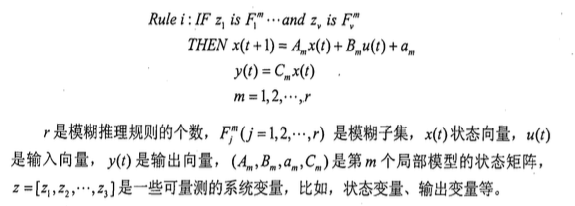
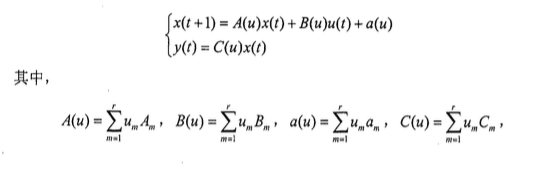
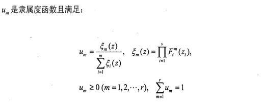
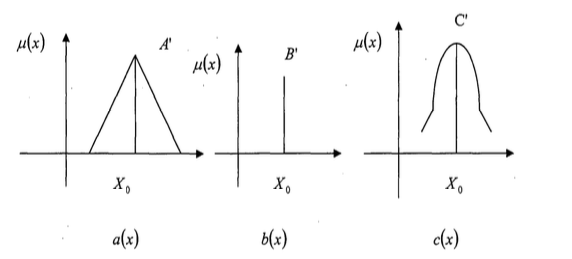
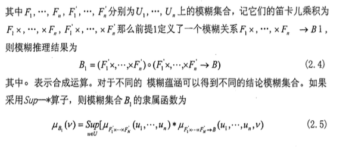
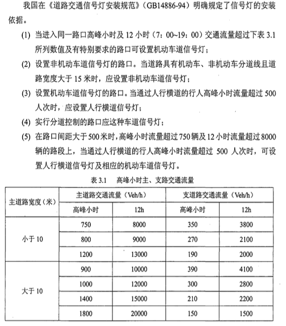
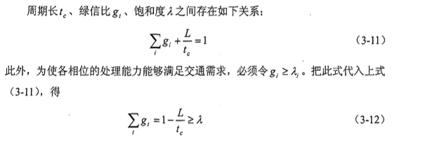
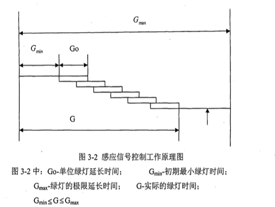
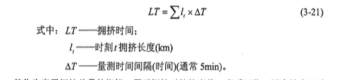
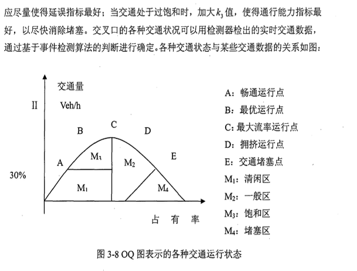

# 论文进展情况

已经完成模糊控制系统以及城市交通信号控制系统的系统学习，正在深入学习模糊控制器的设计方法以及"模糊控制箱"设计模糊控制器的方法。具体学习报告见下文。

# 存在问题及解决措施

在学习模糊控制器设计方法的时候遇到很多看不明白的内容，严重影响了学习进度，因此需要在图书馆多借阅图书，多参照网上资料以及多向指导教师询问，尽早掌握设计方法。

#后期工作安排

在完成模糊控制器的设计方法以及"模糊控制箱"设计模糊控制器的方法后，建立、调试交通信号系统的传统定时控制方法和设计MATLAB仿真模型，根据仿真模型对两种方法进行评价。

## 2 模糊控制系统

### 2.1 模糊控制概述

模糊控制是以模糊集合论作为它的数学基础的,它的诞生是以L.a.Zadeh 1965年提出模糊集理论为标志的。模糊控制经历了30多年的研究和发展己经逐步完善,尤其在应用领域更是成果辉煌。自从1974年E.H.Mamdani首先利用模糊数学理论进行蒸汽机和锅炉控制方面的研究获得成功以后,模糊控制的研究和应用一直十分活跃。模糊控制系统应用于诸如在测量数据不确切、要处理的数据量过大以致无法判断它们的兼容性、一些复杂可变的被控对象等场合是非常合适的。与传统控制器依赖于系统行为参数的控制器设计方法不同的是模糊控制器的设计依赖于操作者的经验。在传统控制器中,参数或控制输出的调整是根据对由一组微分方程描述的过程模型的状态分析和综合来进行的,而模糊控制器参数或控制输出的调整是从过程函数的逻辑模型产生的规则来进行的,改善模糊控制性能的最有效方法是优化模糊控制规则。通常,模糊控制规则是通过将人的操作经验转化为模糊语言形式获取的。对于一个熟练的操作人员,他并非需要了解被控对象精确的数学模型, 而是凭借其丰富的实践经验,采取适当的对策来巧妙的控制一个复杂的过程。若能把这些熟练 操作员的实践经验加以总结和描述, 并用语言表达出来,他就是一种定性的、不精确的控制理论 。模糊控制有一些明显特点  
1）无需知道被控对象的数学模型。  
2）是一种反映人类智慧思维的智能控制。其采用人类思维中的模糊量,如“高”、“中”、“低”、“大”、“小”等 , 控制量由模糊推理导出。这些模糊量和 模糊推理是人类通常智能活动达到体现。  
3）易被人们所接受。模糊控制的核心是控制规则, 这些规则是以人类语言表示的, 如 “衣服较脏 , 则投入洗涤剂较多 , 洗涤时间较长 ”,很明显这些规则易被人 所接受和理解。
4）构造容易。  
5）鲁棒性好。

### 2.2 模糊控制的产生与发展

自从40年前Zadeh提出模糊集合理论,模糊集合与模糊系统已经取得了重大的进步,它已被广泛应用于控制工程、定性建模、模式识别、数字信号处理、信息处理、机器智能、管理、金融、医药、汽车工业、机器人等等。特别地, 模糊逻辑控制作为模糊集合与模糊系统最早应用中的一个已经成为最成功的一个。实际上,模糊逻辑控制已经在复杂非线性系统甚至未知模型系统的控制中显示了其无可比拟的优越性。在许多方面,模糊逻辑控制已经被建议作为传统控制方法的替代方法。  
1974年,Mamdani和Assillia开发了第一个控制小型蒸汽机的模糊逻辑系统,首次把模糊控制从理论走向应用, 其特点是把人的经验转化为控制策略,为模型未知的复杂系统提供了简便的控制模式。从那时起,模糊逻辑控制得到了学术界和工业界的高度重视。许许多多的人在理论研究和模糊逻辑控制器的应用技术上都投入了大量的时间和精力。在这一方向上有许多优秀的书籍和论文可以证明这一点, 比如[38-39],模糊逻辑控制在许多方面同样也取得了成功的应用,比如在电力系统、通信系统、机器人系统、自动驾驶汽车、工业化学过程控制、飞行器、医疗服务、日用电子产品,以及其它领域比如混沌控制、核反应控制。

### 2.3 模糊控制的分类

根据模糊控制规则和产生方法的不同,模糊逻辑控制方法可以大致被分为以下六类:1）传统的模糊控制；2）模糊PID控制；3）神经网络模糊控制；4）模糊滑模控制；5）自适应模糊控制；6）T-S模糊控制。但是,值得说明的是这些类之间的重叠与交叉是不可避免的, 比如传统模糊控制可以是自适应的, 模糊PID控制可以通过神经网络来调节参数等。  
在模糊逻辑控制方面有很多很多好的成果以致我们不可能一一把它们列出来,实际上只有一小部分被附在了本文的后面。而且本综述不可能详细地介绍每一类的发展,取而代之的是,我们简要回顾了一下各个分类,并对各个分类做了一个评价。

#### 2.3.1 传统模糊控制(Mamdani型模糊控制)

Mamdani和Assillian's模糊控制,被Sugeno称之为Type-I模糊控制系统, 已经被应用在各种不同的控制过程。比如机器人、钢铁冶炼、水泥制造、污水处理、 导弹自动导航、交通信号灯的控制、网络控制、生物控制等等 。此外,模糊控制还被广泛应用于各种日常电子产品中,比如:照相机、洗衣机、电视和音响系统。  
传统模糊控制方法真正做到了语义推理和模型的不依赖性。模糊控制 “IF-THEN”规则是基于专家控制方法和知识而得到的。很显然该设计方法只有在
一个专家起重要控制作用的系统才会出现好的效果, 虽然这种控制方法的性能指标 在总体上是令人满意的,但在其发展早期就因无法探讨闭环系统的稳定性而受到指责。更为重要的是,这一控制系统的设计缺乏一个系统而一致的设计方法。文献[41]曾指出,控制器的设计问题成了传统模糊控制发展的一个瓶颈。因此人们在传统模糊控制系统稳定性分析和控制器设计问题上投入了巨大的精力, 并且得到了各种不同的方法,这些方法的主导思想是把模糊控制器看做一个非线性控制器, 然后把模
糊控制系统的稳定性和控制器设计问题植入到传统的非线性系统稳定性理论之中。典型的方法包括描述函数法、Lure's系统方法、Popov's定理、圆周判据等。但是,传统模糊控制稳定性分析和控制器设计的一般的系统的理论仍然没有得到[36]。

#### 2.3.2 模糊PID控制

传统PID控制因为它们结构简单、设计方便、应用成本低的特点仍然被广泛的应用到各种工业控制中 。但是,如果被控对象具有高度非线性或本质上的不确定性,PID的控制性能就不能令人满意。另一方面,传统模糊控制通过模糊集合理论控制非线性和不确定性方面的优点早已为人们所熟知 。所以人们都相信如果把这两种方法结合起来, 就会得到一个好的控制效果。  
在学术界包含各种不同意义的 “模糊 控制”这一提法被广泛的应用了。模糊控制器的一个最大缺点是在保证性能指标的前提下怎样进行控制器设计, 比如模糊规则个数的确定、选择什么样的隶属度函数、隶属度函数的参数如何选择都是通过试错法或经验得到的, 这无疑加大了工业控制应用的难度。具体的例子可以查看文献[43]中的模糊控制器设计和模糊控制器设计的相关内容和文献[44]中的相关内容。

#### 2.3.3 神经网络模糊控制系统

神经网络控制和模糊控制是目前最流行的两个智能控制技术,它们有许多相似之处, 比如它们都是模型不依赖的控制技术,它们都可以储存知识并且应用知识进行控制决策,它们在一定程度上对系统的不确定性和外部扰动都具有较强的鲁棒性。但是, 这两种控制技术在获取知识的方法上截然不同。神经网络控制技术的知识主要通过数据训练,让数据 “自己决策”这是一种优点,但是如果训练数据不能很好地代表系统时,这就成了一个很大的缺点。模糊控制,特别是传统的模糊控制主要是从操作者或专家那儿得到定性或不确定的知识[35,42,46]。  
由于这两种方法可以相互补偿,也就是说,神经网络可以提供学习和很高计算能力,而模糊控制提供了基于专家知识表达的有力框架,所以这两种控制技术的融合引起了控制界的广泛关注。这两种技术的一个典型融合就是所谓的神经网络模糊控制,也就是在模糊控制的基础上加入了神经网络,以提高其灵活性、数据处理和自适应能力。这种控制技术的其它研究方向为通过遗传算法调整神经网络模糊控 制器的参数、通过神经网络模糊控制技术调整控制器参数以及基于小增益理论的输入-输出稳定性分析。  
神经网络模糊控制的一个最大优点是它不需要被控系统的数学模型信息, 因此这一类控制器为解决许多在实际上数学模型很难得到或根本不可能得到的复杂控制 问题提供了一条新的解决途径 。但是这一系统的闭环系统的稳定性分析和在此背景下学习算法的收敛性问题成了这一控制技术应用的一个最主要限制。

#### 2.3.4 模糊滑膜控制

众所周知,在不确定性非线性控制系统中,滑模控制提供了一个鲁棒性控制方法。滑模控制的主要特征包括非线性系统的良好控制性能,多输入多输出系统的应用,最主要的是对参数变化或外部扰动的鲁棒性。模糊滑模控制的主要想法是把滑模控制和模糊控制结合起来,在这种方法下让两种控制技术的优点一起实现。实现模糊滑模控制有两种方法 ,一是让滑模控制器具有处理模糊语言定性信息的能力, 这种控制的一个直接的好处就是通过建立模糊边界层取代精确的调换界面以消除抖动；二是设计一个模糊控制系统比如模糊控制器、模糊控制器或基于模糊控制的模型, 然后加上一个不仅能保证闭环控制系统稳定而且能提高其鲁棒性的监督滑模控制器。  
模糊滑模控制器的另一个重要的优越性是在滑模控制结构下模糊控制系统的稳定性分析和控制器设计问题可以得到很好解决,而且发展完备的滑模控制也可以得到应用。模糊滑模控制的其它研究方向还包括使用遗传算法调整控制器的隶属度函数,把高维系统分解为几个低维子系统以及自适应滑模模糊控制[36]。

#### 2.3.5 自适应模糊控制

自适应模糊控制与传统的自适应控制器相比有着本质的区别。自适应模糊控制器的优越性在于自适应模糊控制可以利用专家提供的具有自适应功能的语义模糊信息,来使控制系统适应被控对象的不确定性, 而传统的自适应控制器则通过系统辨识参数使其具有自控功能。对于具有高度不确定因素的系统尤为重要, 例如, 化学反应过程或飞机等系统,虽然从控制理论的观点来看是很难控制的,但操作人员却常常可以成功地控制这类系统。目前较为成熟的自适应模糊控制的类型如下：1）量化因子和比例因子的自调整模糊控制器；2）自组织的模糊控制器3）自适应模糊PID控制器4）自适应递阶模糊控制；以上四种模糊自适应模糊控制器的特点是无须知道被控对象的模型,直接应用模糊语言规则进行推理、决策和控制。这些方法的优点在于简单 、易于实施,但缺点是缺少对控制系统的稳定性和收敛性分析；5）稳定的非线性自适应模糊控制；这种自适应控制器中的模糊算法是模糊逻辑系统配备某种训练算法并按照输入、输出数据进行参数调节,其显著的特点是设计控制器时可以把专家知识结合到模糊逻辑系统中,基于Lyaunov方法给出模糊系统的参数自适应调节律,并严格证明了模糊控制的稳定性问题。

#### 2.3.6 T-S模糊系统

具有模糊推理规则和局部线性动态模型的T-S模糊模型可以用来描述复杂多输入多输出系统,特别地, 模糊系统可以通过一系列的IF-THEN规则来描述, 这些规则局部地表示线性输入一输出关系。这一模糊系统可以写成下面的形式:

通过经典的模糊推理方法, 也就是说,单点模糊化 、乘积推理、加权平均反模糊化,可以得到全局 模糊模型如下:

### 2.4 模糊控制系统的组成

模糊控制系统的主要部件是模糊化过程、知识库(含数据库和规则库)、推理决策和精确化计算。

**模糊化过程**  
模糊化是将一个确定的点映射成一个模糊集合。  
模糊化过程主要完成：测量输入变量的值,并将数字表示形式的输入量转化为通常用语言值表示的某一限定码的序数。每一个限定码表示定域内的一个模糊子集,并由其隶属函数来定义。对于某一个输入值,它必定与某一个特定限定码的隶属程度相对应。下图给出了三种模糊化函数。除以下三种外,还有梯形函数的隶属度函数、正态分布的隶属度函数等很多。通常选三角形和梯形函数的隶属度函数在实际应用中很方便。

**知识库**  
知识库包括数据库和规则库。数据库主要包括量化等级的选择、量化方式（线性量化或非线性量化） 、比例因子和模糊子集的隶属度函数。这些概念都是建立在经验和工程判断基础上的, 其定义带有一定的主观性。  
1）论域的离散化  
通常表示这种信息的模糊论域可以是连续的也可以是离散的。为了便于数字计算机处理, 一般首先将连续的论域离散化形成离散论域。论域的离散化实质上是一个量化的过程。量化就是将一个论域离散成确定数目的几小段（量化级）, 每一段用某特定术语作为标记,这样就形成一个离散域。然后将通过对这新的离散域中的特定术语赋予隶属度来定义模糊集。为了实现离散化,必须将测量的非模糊系统变量的值映射到离散域中的量值,这种映射可以是线形的也可以是非线性的。  
2）输入输出空间的模糊划分  
模糊控制规则前提中的每一个语言变量都形成一个与确定论域相对应的模糊输入空间,而在结论中的语言变量则形成模糊输出空间。一般情况下,语言变量与术语语言值集合相联系,每一个术语被定义在同一个论域上。那么模糊划分就确定术语集合中有多少个术语,也就是说模糊划分就是确定基本模糊集的数目。  
3）基本模糊子集的隶属度函数  
模糊集的隶属度函数是数据库的一个重要组成部分 。通常有两种模糊集隶属度的表示方式：一是数字表示；二是函数表示。数字表示适用于论域是离散的情况。此时,模糊集隶属度函数的等级是用一个矢量来表示的。例如输入值属于不同模糊子集的隶属程度用一个矢量来表示。当输入领域的量化等级总数为5, 并分用μ1表示时,即可写成：

模糊规则来源于人们离线或在线对控制过程的了解 。人们通过直接观察控制过程, 对控制过程的特性能够有一个直观的认识。虽然这种认识不是很精确的数学表达, 只是一些定性描述, 但它能够反应控制过程的本质,是人的智能的体现。在此基础上, 人们往往能成功的实施控制。因此, 建立在语言变量基础上的模糊控制规则, 为表达人的控制行为和决策过程提供了一条有效的途径。

规则库   
模糊控制系统是用一系列基于专家知识的语言来描述的, 专家知识常采用“IF...THEN”的规则形式,而这样的规则很容易通过模糊条件语句描述的模糊逻辑推理来实现。用一系列模糊条件描述的模糊控制规则就构成模糊控制规则库。目前模糊规则库的建立大致有四种方法:专家经验法、观察法、基于模糊模型的控制和自组织法。前两种方法的模糊控制都是通过专家的模型,然而,对有的控制对象, 根本无法找到该领域有经验的控制专家,或者专家的模型需要时常更改将带来诸多不便。自组织法能够在没有先验知识和很少有先验知识的情况下通过对观察系统的输入输出关系建立控制规则库。

**推理决策逻辑**  
推理决策逻辑是模糊控制的核心，它利用知识库的信息模拟人类的决策过程，根据模糊系统的输入和模糊推理规则，经过模糊关系合成和模糊推理合成等逻辑运算，给出合适的控制量。它的实质是模糊逻辑推理。模糊逻辑中用到的模糊逻辑推理是由输出量和模糊规则得到输出量的前向推理，最基本的前向推理有下面的集中形式：  
1）基本模糊推理  

2）复合蕴含的模糊推理  

3）多重蕴含的模糊推理

**精确化过程**  
通过模糊推理得到的结果是一个模糊集合。但在实际使用中, 必须要有一个确定的值才能去控制。 在推理得到的模糊集合中取一个能最佳代表这个模糊推理结果可能性的精确值的过程就称为精确化过程(又称为反模糊化)。精确化可采取很多不同的方法,用不同的方法所得到的结果也是不同的。常用的精确化计算方法有以下三种:  

精确化计算的方法还有很多, 如左取大、右取大、取大平均等。总的来说,精确化计算方法的选择与隶属度函数的形状选择、推理方法的选择都是相关的 。最大隶属 度函数对隶属度函数的形状要求不高。

## 3 城市交通信号控制系统

### 3.1 信号交叉口的设置

随着交通和科技的发展, 通过交通信号的作用, 利用红、黄、绿灯色 以及箭 头、人形等 为互相冲突的车流、人流分配通行权, 以保证交通运行的安全和顺畅。这种交通信号的控制, 在现代道路交通管理中得到了越来越多的应用。

#### 3.1.1 无信号交叉口的适用条件

国外, 平面交叉口在安装信号灯之前, 一般多用停车标志 让路标志 来管理 交叉口的车辆运行。这种控制方式是把停车 让路 标志设在次要道路上, 规定次 要道路车辆通过交叉口时, 必须在停车线前停车观察, 不致同主要道路车辆发生冲 突 或必须先让主要道路车辆通过后才可通过。所以, 当次要道路交通量少于停车让路 标志管制下的通行能力, 且总延误较少时, 一般不考虑采用交通信号控制 系统。  
这种管制方式, 对于主要道路上的车辆有很大的好处, 即可畅通无阻, 通行能 力最高, 几乎没有延误 但对次要道路车辆而言, 却只能在主要道路车辆通行之余才能通过, 通行能力有限, 延误很大。当次要道路上车流量较大时, 就会导致次要 道路车辆拥挤严重, 延误大增。  
另外, 也存在着交通冲突、交通事故的隐患。

#### 3.1.2 交通信号灯的设置依据

一个交叉口是否需要设置交通信号灯, 实行交通信号控制, 主要是看该交叉口 交通繁忙程度、混乱程度和事故多少, 不过有时为了对某地点实施保护 如学校、首脑机关等 、 限制车辆速度和车辆进入 , 必须设信号灯 。但大致来讲 , 设立信号灯 主要考虑以下几个因素:  
1)横穿道路的行人和非机动车数量  
2)交叉口总的交通流量  
3)历史的事故记录

**设置交通信号控制的理论依据**  
当主次道路交通量达到一定程度后停车 让路 标志改为信号控制, 交叉口主 次道路的综合通行能力大于停车 〔让路 标志时的通行能力 , 综合延误小于停车 让 路 标志时的延误, 则改装信号灯控制。

**我国设置交通信号灯实际使用的依据**  

#### 3.1.3 设置信号交叉口的优点

1）减少车流、人流的相互干扰和冲突, 建立一个顺畅的交通秩序环境, 确保 交通安全  
2）确保横穿人行横道的行人安全  
3）合理地为相交叉的道路车流分配通行权, 合理地调节路线, 从而提高整个 路口、路线、路网的同学效率  
4）通过系统设计, 控制车辆按合理车速行驶, 从而确保安全、顺畅, 改善交 通环境。

#### 3.1.4 行人信号灯的设置

有人行横道时, 必须设置保证通过人行横道的信号相位。为行人设置的相位时 间为以 侧 的步行速度过完横道所需的时间, 即取与人行横道长度 单位为 相 同数值的秒数。在左右转车较多、危险性大的情况下, 为安全起见, 有必要设置行
人专用相位 。  
与行人交通流交叉的车流速度较低 , 或右转车较少 , 且行人容易观察到车辆时 ,
可以用同一个相位来处理车与行人 。

#### 3.1.5 联通交通信号灯

沿主要交通干道 , 有一批交通信号控制的交叉口时 , 需要采用联动的信号系统 , 使主要干道的车辆尽量避免在每个交叉口上停车。此外, 把信号连接起来, 还可使 车辆延误减到最小。有时候, 信号间的联结, 还可使排队车辆避免从下游交叉口向 后延伸到上游交叉 口 。  
信号之间的联结有多种方式 , 其中的三种是：同时系统 , 交变系统和可变连续通行系统。  
同时系统中, 联结在一个系统中的全部信号, 在同一时刻, 对着同一的车流, 显示相同的灯色。有些局部控制, 可用车辆感应式控制, 但主控制器必须使所有局 部控制器保持同步, 并实施一个统一的周期时间。这种控制系统有一个明显的缺点 就是 给驾驶员展现了一批亮着绿灯的信号, 诱使驾驶员争相在信号全部变为红灯 之前尽量通过绿灯, 就会造成高速行驶的趋势。但在转向交通较少, 以及交叉口密 集的地方, 这种系统可有利于行人的通行。  
交变系统, 使一段给定路段上的信号器, 展现相反的灯色, 全部信号的周期时 间必须统一, 且必须随行驶车速而定。因此, 各交叉口间距离不相等的主要干道,用这种系统就有困难 。  
可变连续通行系统, 是根据路上的要求车速, 对各相邻交叉口上的绿灯启亮时
刻, 相互间安排相应的时间偏移的一种信号联动控制系统。由于必须兼顾沿路相对两个方向车辆的畅通行驶, 因而, 往往要在两向车流间作出综合平衡, 同时也要兼 顾主要道路与次要道路车流间的综合平衡 。

#### 3.1.6 区域信号灯控制系统

**概念**  
区域交通信号控制系统的控制对象是城市或城市的某个区域中的所有交叉口的交通信号。区域交通信号控制系统的正确概念是 把控制对象区域内全部交通信号 的监控, 作为一个交通监控中心管理下的整体控制系统。

**分类**  
A、按控制策略分类  
1）定时式脱机操作控制系统  
这种系统是利用交通流历史及现状统计数据进行脱机优化处理, 得出多时段的最优信号配时方案, 存入控制器或控制计算机内, 对整个区域交通实施多时段定时 控制。  
定时控制简单、可靠与效益投资比高, 但不能适应交通流的随机变化, 特别是 当交通流量发生变化, 并与优化计算当时的交通流量差别较大时, 控制效果明显下 降。重新制定优化方案时, 作交通调查及进行优化计算将消耗大量的人力和时间。  
2）感应式联机操作控制系统  
这种系统是一种能够适应交通量变化的 “自适应控制系统 ”, 也叫 “动态响应控
制系统 ”, 此系统在控制区域交通网中设置检测器 , 实时采集交通数据并实施联机最 优控制。自适应控制系统结构复杂、投资高、对设备可靠性要求高, 但能较好地适 应交通流的随机变化, 对交通流特性变化较大的城市, 将提高控制效益。

B、按控制方式分类  
1）方案选择方式  
对应于不同的交通流状况, 事先做好各类交通控制方案和相应的控制参数并存 储在计算机内, 按实时采集的交通流数据 , 选取最合适的交通控制方案与控制参数 , 实施动态交通控制 。  
2）方案形成方式  
根据实时采集的交通流数据, 实时计算最佳交通控制参数形成控制方案, 实施动态交通控制 。

C、按控 制结构分类  
1）集中式控制结构  
将网络内所有信号联结起来 , 用一台中、小型计算机对整个系统进行集中控制。  
集中式控制的优点是 全部控制设备只位于一个中心, 系统的研制和维护不太 复杂, 所需设备少, 维修容易。  
集中式控制的缺点是 大量数据的集中处理及整个系统的集中控制, 需要庞大 的通信传输系统和巨大的存储容量, 这就极大的影响了控制的实时性, 并限制了集 中控制的区域范围 。  
2）分布式控制结构  
把整个控制系统分成上层控制与下层控制, 上层控制主要接收来自下层控制的
决策信息, 并对这些决策信息进行整体协调分析, 从全系统战略目标考虑修改下层 控制的决策 下层控制则根据修改后的决策方案, 再作必要的调整。上层控制主要 执行全系统协调优化的战略控制任务, 下层控制则主要执行个别交叉口合理配时的 战术控制任务。这种结构可与避免集中式控制的缺点, 且有降级控制的可能, 提高 了系统的可靠性, 但需增加设备, 投资较高。

### 3.2 信号控制的基本概念

交通信号控制是利用交通信号装置, 对道路上运行的车辆和行人进行指挥和疏 导。所谓交通信号装置是指交通管理部门根据国家有关法律规定, 在道路上向车辆 和行人发出通行 、 停止 、 或停靠的具有法律效力的信息 。交通信号控制是交通控制 的重要组成部分, 是科学管理的一种有效手段。现代化的交通信号控制系统的作用 主要表现在以下几个方面：  
1）改善交通秩序, 提高通行能力  
由于交通控制系统采用科学的方法和手段对交通流进行时间分割, 使交通流保
持在一种平稳的最佳运行状态, 以减少交通延误, 可以使己有的道路宽度和通行能 力得到充分的利用, 从而使城市交通中不断增加的拥挤堵塞现象得到有效缓解。  
2）节省能源损耗 , 提高交通效益  
交通控制系统能最大限度地保证交通流运动的连续性, 使受控区的交通流冲突减少, 并能平稳地, 有规则地运动。它可以减少停车次数, 减少停车过程中加速, 减速带来的消耗, 从而减少能源消耗, 降低旅行时间, 提高交通效益。  
3）预防交通事故, 增加交通安全  
在世界上很多国家, 交通事故引起的人生伤亡已远远超过了自然灾害, 火灾等
意外事故, 而通过使用现代化的科学技术手段对道路进行全面的协调控制, 可以有 效的减少交通事故, 增进交通安全。  
4）减少大气污染, 改善城市环境  
汽车在启动过程中污染更加严重, 实行交通控制可以减少停车次数, 减低汽车尾气排放, 从而改善城市环境。  
5）节省城市用地, 增加城市发展空间  
交通用地是城市的主要用地类型之一, 交通控制系统的应用, 可以最大限度地 利用现有道路, 提高它们的通行能力, 从而减少新建, 扩建道路成为可能, 有效的 节省了城市用地, 增加了城市发展空间。

#### 3.2.1 控制参数的种类和功能

交通信号控制的基本参数包括周期时长、相位持续时间 或相位绿信比, 或交通流绿信比 、相位差。

信号控制中的主要参数为周期长、绿信比和相位差, 这些总称为控制参数。

1、周期长  
一个信号灯表示绿 、 黄 、 红一个循环 从绿灯开始到下一次绿灯开始为止 所需的时间称为周期长,以 秒为单位表示。是决定点控制定时信号交通效益的关键控 制参数。一般信号灯的最短周期时长不少于 , 否则就不能保证几个方向的车辆 顺利通过交叉口。最长周期时长一般不超过 , 否则, 可能引起等待司机的烦 躁或误 以为灯色控制 己经失灵 。适当的周期长对疏散路口处的交通流 、 减少车辆等 待时间有重要意义 。  
从单纯提高通行能力的角度来讲, 显然当交通需求越大时, 周期应越长, 否则 一个周期内到达的车辆不能在该周期的绿灯时间内通过交叉口, 就会发生排队等候
现象。从减少车辆等待时间的角度来计划, 太长或太短的周期都是不利的。若周期 太短, 则发生上述堵车现象。若周期太长, 则某一方向的绿灯时间可能大于实际需 要长度 ,而另外方向的红灯时间不合理的延长必然导致该方向车流等待时间的延长 。  
1）最佳周期长

2）合理的周期长度

2、绿信比

3、相位差  
周期长、绿信比是针对单个交叉口的控制参数, 而相位差则是针对相邻接的多个交叉口的控制参数。例如, 考虑线控的信号机群时, 从某一车流方向来看, 为使 车辆在交叉口处不受阻而流畅通过, 与其使相关的信号同时显示同一灯色 特别是 绿灯开始时间 , 不如使绿灯开始时间错开一些 。这里我们称表示就时间的 “错开 ” 称为相位差 。相位差有相对相位差和绝对相位差两种 。各个信号机与该信号机群共 同的基准时间 例如某个特定信号机的绿灯开始时间 的相位差称为绝对相位差 与邻接的信号机的相位差称为相对相位差。两者均以 或周期长的百分率来表示。 相位差的基本方式有以下几种：  
1）优先相位差方式  
各方向交通量相差大, 或单向通行、人为地欲使其优先通行时采用的方式。其目的是使一个方向的交通畅通 。此方式多用于放射状的干线道路的早晚高峰时段 。  
2）平等相位差方式  
平等的处理两个方向的交通 , 使两个方向具有同等通畅程度的方式 。此方式适 用于各方向交通量相差不大的情况 。具体来说具有 以下几种方式：  
（1）同时式相位差方式
沿着系统路线, 相邻交叉口几乎同时变绿的相位方式（相位差几乎为0%）。一般信号间隔短时, 为了避免车辆不断地在交叉口处遇到红灯停车而采用方式。  
（2）交互式相位差方式  
系统路线的相邻交叉口的信号几乎均相差半个周期显示绿灯的相位差方式 。相 对相位差约为50%。

4、周期长、绿信比、饱和度的关系

#### 3.2.2 控制方法的种类和功能

一 、 控制方式的种类  
信号控制有各种各样的方式, 其分类也有很多种。按控制范围分类, 可以将信 号控制分为点控、线控和面控。按控制方法分类, 可以分为定时控制和感应控制两种。

二、按控制范围分类  
1.单个交叉口的交通控制  
每个交叉口的交通控制信号只按照该交叉口的交通情况独立运行, 不与其邻近交叉口的控制信号有任何联系的 , 称为单个交叉口交通控制 , 即 “点控制 ”。这是交 叉口交通信号控制的最基本形式 。  
这种控制方式的优点是灵活, 简便。与相邻交叉口的信号配时无固定关系, 控 制参数只有周期长和绿信比。车辆延误和交叉口的通行能力是必须考虑的因素, 理 想状况下, 希望总延时最小, 并使交叉口的通行能力达到最好的利用。对于某些不 适宜采用联动信号控制系统的交叉口, 这种控制方式能起到很好的作用。  
这种控制方式的缺点是不能与相邻的交叉口进行很好的协调控制 。  
2.干道交叉口信号协调控制  
把干道上若干个连续交叉口的交通信号通过一定的方式联结起来, 同时对各交 叉口设计一种相互协调的配时方案, 各交叉口的信号灯按此协调方案联合运行, 使车辆通过这些交叉口时 , 不致经常遇上红灯 , 称为干道信号协调控制 。也叫 “绿波 ” 信号控制, 俗称 “线控制”。  
这种控制方式的优点是可以把干道上一批相邻的交通信号连接起来, 加以协调 控制。使得千道上双向行驶的车辆从一个交叉口驶向相邻交叉口时, 尽可能遇到绿灯。从而使车辆连续通行。  
这种控制方式的缺点是对客观条件 如车流的到达特性、 信号交叉口之间的距离、街道运用条件、信号的分相和交通随时间的波动 要求太高。也就是说这些条 件或多或少的会影响到整个线控系统的控制效果 。  
3.区域交通信号控制系统  
以某个区域中所有信号控制交叉口作为协调控制的对象, 简称为区域交通信号控制系统, 俗称 “面控制”。  
控制区内各受控交通信号都受中心控制室的集中控制, 对范围较小的区域, 可
以整区集中控制 范围较大的区域, 可以分区分级控制。分区控制的结果往往使面 控制成为一个由几条线控制组成的分级集中控制系统, 这时, 可认为各线控制是面 控制的一个单元, 有时分区成为一个点、线、面控制的综合性分级控制系统。  
这种控制方式的优点是可得全区域整体控制之利, 可因地制宜选用合适的控制 方法, 可有效经济地使用设备。  
这种控制方式的缺点是复杂的数据处理以及由此带来通信传输系统和存储容量 的问题。

三 、 按控制方法分类  
1、定时控制  
交叉口信号控制机均按事先设定的配时方案运行, 也称为定周期控制。 定周期控制是对应于交通需求的变动参数, 将一天分为几个时间段, 相应于不 同的时段设定不同的周期长、绿信比等信号控制参数, 由时钟来控制变换参数的控 制方式 。在日本一般多采用可设定低峰时间用 、通常时间用、拥挤时间用等 个种 类的程序 一套控制方案 。因为此方式采用内装日历的多段程序方式, 即使平日和休息日的交通量实际变动模式有差别时也可以处理 。  
定周期控制方式适用于交通量的变动模式基本固定 、 并可以预测的情况 。但因某种原因变动模式发生变化时要修改控制参数。在实用上, 由于它设备简单, 投资 最省, 维护方便, 仍是被广泛采用的一种控制信号。定时信号配时技术的基本原理 也是其他控制方式配时的基础 。  
2、 感应控制  
感应控制方式是对应于交通状况的变动进行实时控制的方式 。该方式是根据使用车辆感测器测得的比较短的时间内交通需求的变动, 改变绿灯时间和周期长的控 制方式 。  
1）感应信号的基本工作原理如图

某相位起始绿灯后 , 感应信号控制器内预设有一个 “初期绿灯时间 ”, 到初期绿 灯结束时, 如在一个预置的时间间隔内, 无后续车辆到达, 则每更换相位 如检测 器测到有后续车辆到达 , 则每测到一辆 , 绿灯延长一个预置的 “单位绿灯时间 ” 此 时 , 只要在这个预置的时间间隔内, 车辆中断 , 就换相连续有车 , 则绿灯连续延长 , 绿灯一直延长到一个预置的最大绿灯时间, 即使检测到后面仍有来车, 也中断这个 相位的通车权。  
2)感应式控制的具体流程如图

3)感应式控制的分类  
感应式控制又可分为半感应式控制和全感应式控制两种 。

（1）半感应式控制：  
次路检测半感应控制流程图

主路检测半感应控制流程图

（2）全感应式控制  
全感应式控制的特点是在所有入口车道上都设置检测器的感应控制方式 。适用于相交道路等级相当、 交通量相仿且变化较大的交叉口上 。但不适用于交通量变化 平稳的交叉口。

全感应控制方式很多 , 我国自行设计并制造了几种全感应信号控制机 。

1） 基本全感应控制  
这种感应控制的控制机理是 当交叉口没有机动车到达时, 信号机以一定周期
方式按最小周期运行。当某一方向来车时, 则对来车方向亮绿灯 以后就按感应信 号的基本机理运行 。  
2）特殊感应控制  
特殊感应控制, 可在一般感应控制上, 按特殊需要, 增加特殊的感应装置, 执
行特殊需要的感应控制功能。平时仍可按通常的交通需求, 执行一般的感应控制, 一旦接到特殊感应信息时, 立刻执行特殊的控制功能。如公共交通优先感应控制、消防 、 警卫等特种车辆优先感应控制等 。  
3）行人信号控制  
人行横道的信号控制方式有定周期控制和按扭控制 。繁华街 、 车站周围以及办 公区、 商店街等地点全天都有行人穿越横道, 即使在高峰时间以外也大致平均一分 钟有一人以上的交通需求, 所以进行定周期控制为好。按钮式控制适用于需求量随 时间变动显著, 存在着几乎无人过街的时间段或需求量不大的时间段等情况。

### 3.3 信号控制的评论指标

对平面交叉口实行信号控制的基本目标是 用灯色信号合理分配入口车道通行 权, 使路口有良好的秩序, 减少或完全消除可能引起交通事故的冲突点, 并使得路口的运行指标最好。平面交叉口的控制问题可用数学语言描述如下 求G，使得：

信号控制的评价指标 , 一般有通行能力或饱和度 、行程时间、延误 、停车次数、或停车率及油耗等。对于信号控制的交叉口, 在一定的道路条件下, 通行能力受信 号周期时长形响, 在正常周期时长范围内, 周期时长越长, 通行能力越大, 但车辆 延误及油耗等随之增大, 信号交叉口从延长周期时长所提高的通行能力远大于交通 需求时, 即饱和度相当小时, 对通车状况并无多大好处, 却会无谓的增加车辆延误 与油耗。所以, 信号控制交叉口的信号配时, 应在一定的道路条件下, 配以适当的周期时长, 让通行能力稍高于交通需求而使延误、停车、油耗等指标达到最小。这 样, 既能保证车辆的畅通又能降低运行费用。因此, 现在一般以延误、停车、油耗 和行车时间作为评价指标 。下面对上述指标进行详细介绍 。

1、 旅行时间  
旅行时间是指通过某个区间所需的总时间, 包括停车等引起的延误时间, 但不包括车道以外的延误时间和在车道上的停车时间 。旅行时间的计测是为了把握路线 全体或路线中比较长的一段区间的交通状况。根据旅行时间指标, 可以判定被测线 路上的瓶颈地点和信号的系统时间排列是否合适 。  
2、通过交叉口的所需停止、起动次数以及等待信号次数  
停止、起动次数是指在被测区间行走过程中, 由于信号而停止, 之后再启动的回数 。等待信号次数是指到通过信号灯时为止通行方向上相位的红灯次数 。  
停止次数随相位差的适当与否而变动 , 因此可作为系统控制效果的尺度 。此外 , 停止 、 启动次数和等待信号次数通常相互关联 。可作为衡量饱和程度的指标 。等待信号次数还可用于表示等待队列长度的状态量 。  
3、通行能力  
通行能力是指在一定时间内通过某交叉口所有进口道停车线车辆数之和 。交叉口的通行能力不仅与控制策略有关, 还与实际道路条件包括引道宽度、车道功能、 分配和车道数 、 转弯半径 、 转弯长度 、 引导坡度 和交通条件 车流量 、 车辆种类 、 左右转弯车比例 、 车速 、 非机动车和行人干扰 、 车道功能划分等 密切相关 。通行能 力是交叉口饱和程度的重要评价指标。  
4、 处理量  
处理量是在实际的道路条件下 进口道的形状 、 宽度 、 配置等 、 交通条件 车辆种类 、左右转弯车混入率 、停车站的位置 、停放车辆等 以及控制条件下 , 在一定时 间内通过进口道停车线的最大车辆数 。用作过饱和交叉口的评价指标 。  
5、拥挤时间  
拥挤长度是滞留在作为瓶颈口的交叉口或某个地点进口道的车队长度。通常
根据每 的车辆检测器的数据来推算 。拥挤时间是某个时间范围内（12h或一天等）拥挤长度的时间积分值, 采用下式计算：

其作为表示拥挤总量的指标, 用于拥挤对策的事前、事后评价。调查地点可选瓶颈交叉口、 路段、 区域等 。  
需要指出的是, 在一个控制系统中, 这些评价指标并不能同时达到最优。例如要想提高通行能力和减少起停次数, 就必须延长信号周期, 但是信号周期超过最佳 周期, 延误指标就会变坏。所以对于多目标的信号控制系统, 就必须引进综合指标 这一概念 。综合指标是用上述某几项指标的加权和表示 。最常用的综合指标表示如下：

### 3.4 交通信号控制系统的结构

1、第一代 非计算机控制系统  
控制功能由专门设计的硬件逻辑完成 。这些硬件可能是机械一电器装置或者电子装置 。这种系统处理数据的能力很有限 , 不能对大量监测到的测量数据进行计算 , 所以其功能主要是定周期控制或者根据时间进行方案选择式控制 。  
2、第二代 集中式计算机控制  
在控制中心需要设置一台或多台数字计算机, 对众多路口实行交通控制。可以采用较高级的控制策略, 例如方案选择式或方案生成式响应控制。目前投入运行的 以方案选择式居多。这是因为方案生成式需要复杂的软件和一定的计算速度, 这需 要大型的计算机才能完成实时的在线控制 另一方面, 它要求较精确的对现场交通情况进行预报和估计, 这需要设置更多数量的检测器及数据处理装置 再则, 它需 要更复杂的通讯系统 。  
3、 分布式计算机控制系统  
随着微型计算机的普及, 单个交叉口有可能备有自己的微处理器 , 即使路口再多, 也不再担心数据通信的代价高昂, 因为检测数据可以就地在局部微型计算机上 处理, 局部机的功能是直接控制该交叉口的交通, 同时与控制中心的计算机保持通信, 接受某些控制参数作为产生本交叉口控制策略的基础, 并上传某些数据。这种 信息传递的数量大大降低, 且对速度的要求也降低了。这就使得方案生成式响应控 制成为现实 。  
对不太复杂的交通网络, 可省去控制中心, 由一台设在关键路口的局部微机兼 主控制器的功能, 接收各交叉口送来的重要数据, 进行自适应计算或优化计算, 决定实时控制参数, 传给各局部微机。数据的通信可方便采用光纤、电话线。用微型 计算机来实现编码、解码、纠错等功能, 可靠性大大提高。  
在较复杂的网络中, 需要一个监控中心, 由于局部微机功能较强, 监控中心的 任务远不像集中控制系统中那样繁重, 由一台或少数几台微机即可胜任。

### 3.5 本章小结

本章主要对城市交通信号控制系统的一些基本概念 、 控制方式 、 控制参数 、 信号控制评价指标及交通信号控制系统的结构等进行了详细的论述
